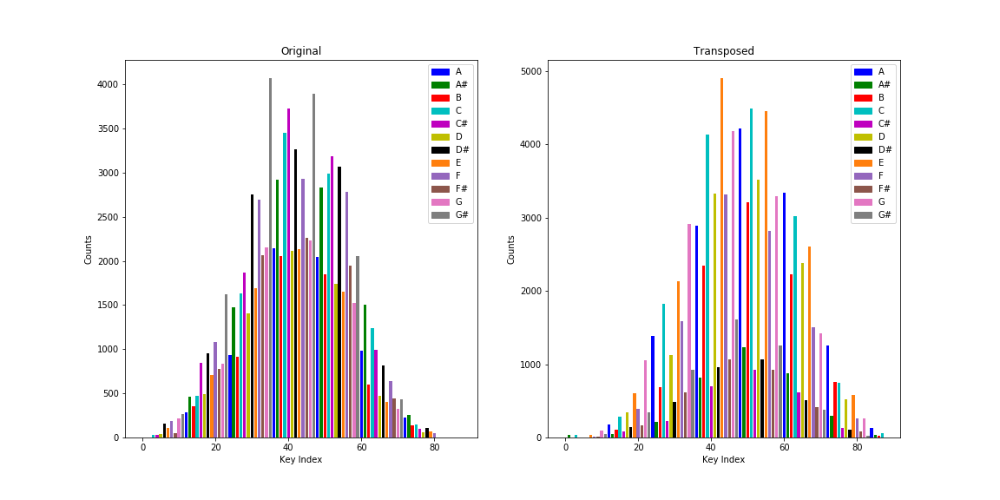
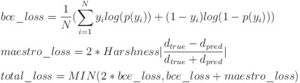

# Springboard_Capstone
Music Generation with LSTM network trained the music of Chopin ([Kaggle dataset](https://www.kaggle.com/soumikrakshit/classical-music-midi))

The model architecture and encoding largely follow the process described by this [paper](https://www.tandfonline.com/doi/full/10.1080/25765299.2019.1649972) in which a similar network is trained on the music of Bach. However, there are two other important differences:
  1. Instead of the data augmentation method used by the paper (randomized transpositions of songs to different keys), I transpose all songs to the key of C Major)
      - One advantage is shorter training while still containing the same amount of musical information
      - Another is a simplification of the problem the neural network needs to solve
      - One can still transpose the generated music to any key following inference
      - The effect this has on the data is most easily understood from the following plot where the x-axis is the index of (0-87) of the piano key being played and the y-axis is the total # of times that key was played in the dataset (see ./notebooks/data_read_and_process.ipynb for the code and more details)

  2. Added custom loss function which penalizes for the error in a duration prediction (in addition to error in the prediction of notes and chords via standard Binary Cross-entropy)
      - I haved named this function the <b>Maestro Loss</b> which can be tuned with a parameter (<b>harshness</b>). A higher harshness gives more weight to the duration prediction (see ./noteooks/model_training.ipynb for the code and more details):

  
<b>Directory Structure</b>

    .
    ├── chopin                  # Contains MIDI files downloaded from Kaggle (link above)
    │   └── *.mid
    ├── docs                    
    │   ├── Capstone_Proposal.pdf
    │   └── deployment_strategy
    ├── images                  # Contains the images embedded above or in the web application
    │   ├── chopin.jpg    
    │   ├── maestro_equation.jpg
    │   └── original_vs_transposed.png
    ├── midi_output             # Contains MIDI files generated from validation data (which is used as music generation input) or music generated from a model on such an input
    │   └──  *.mid
    ├── model_data              # Contains .csv files with training performance data (loss and metrics vs. Epochs). Saved in ./notebooks/model_training.ipynb and read-in by visualize_performance.ipynb
    │   └──  *.csv
    ├── models                  # Contains .h5 files with trained models. Saved in ./notebooks/model_training.ipynb and best model read-in by ./web_app/ChopinBotApp.py
    │   └──  *.h5
    ├── notebooks               # Contains Jupyter notebooks. They are meant to be run/understood sequentially in the order they appear below (also alphabetical)
    │   ├── data_read_and_process.ipynb
    │   ├── model_training.ipynb
    │   └── visualize_performance.ipynb
    ├── train_and_val           # Contains .npy files (git lfs) of the training and validation partitions of the processed dataset (./notebooks/data_read_and_process.ipynb)
    │   ├── X_train.npy
    │   ├── y_train.npy 
    │   ├── X_val.npy 
    │   └── y_val.npy 
    ├── web_app                 # Contains web application code using [Streamlit](https://www.streamlit.io/). Run as 'streamlit run ChopinBotApp.py' (Work in progress)
    │   ├── ChopinBotApp.py      
    │   ├── custom_funcs.py     # Custom functions written in keras backend language. Necessary to load a trained model file (.h5) from ../models
    │   └── seed_index.txt      # Streamlit runs everytime the user makes a change (caching data and function outputs (unless they need to be recomputed). In order to store a randomly generated index (which provides the seed for the music generation) we use this file. ChopinBotApp.py writes to the file when the user requests a new seed, and otherwise reads from it.
    └── ...
    
